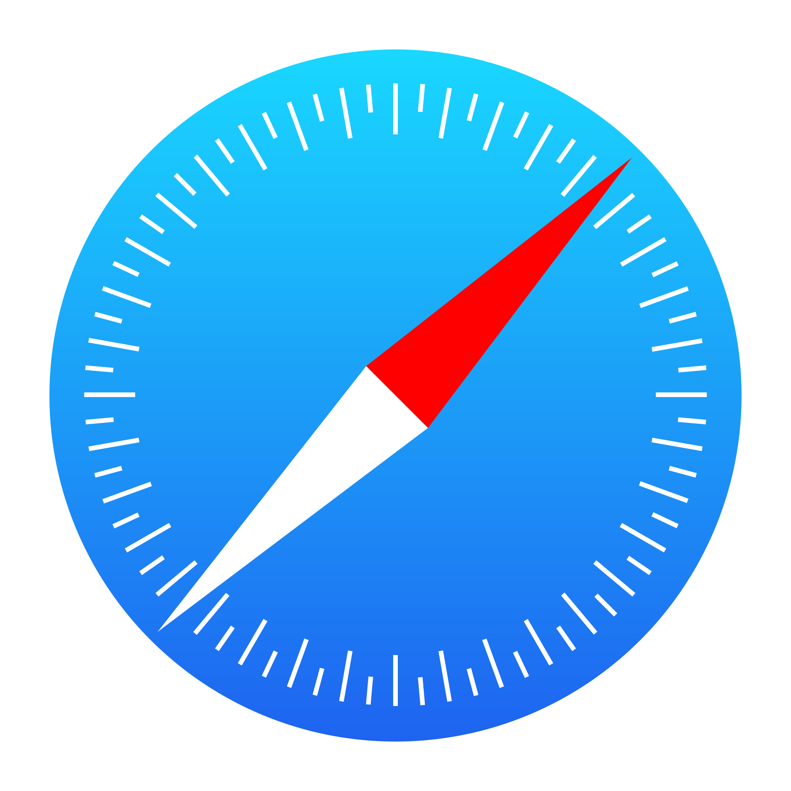
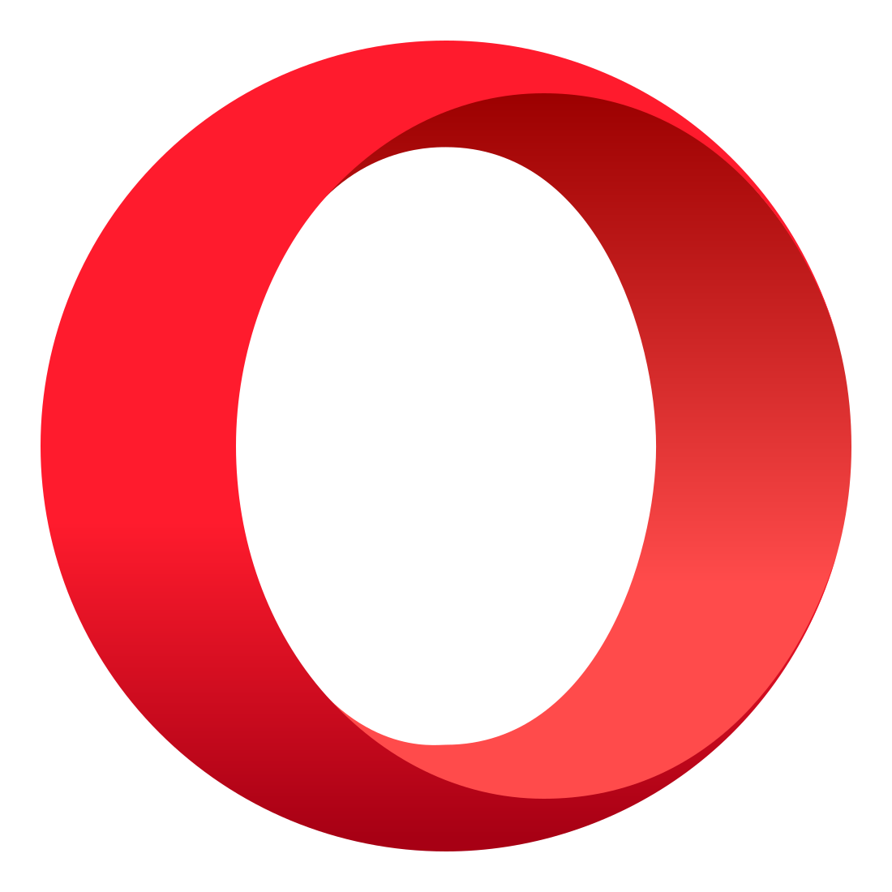

很久前的想法，做个 widget 放在头像旁边：加载的时候让浏览器图标一直转圈。图标会对应不同的浏览器变化

    

## 2023-05-14 updated

当初想放在方形头像的右下角，现在使用了圆形头像就没有用武之地了。

不该做 Opera 的动画的，除了费时且没用外：1. 没做好，应该使用中心投影 2. Webkit 目前还不支持给这样的动画插帧。

当初是做成了一些组件 [browser-logo-spinner](https://github.com/lonr/browser-logo-spinner)，使用了 API 让动画停止前转完当前周期后停止而不是反向转圈。这里没写下来。

## 浏览器识别

各浏览器 user agent 字符串

- Firefox: https://developer.mozilla.org/en-US/docs/Web/HTTP/Headers/User-Agent/Firefox
- Chrome: https://developer.chrome.com/multidevice/user-agent
- Opera: https://help.opera.com/en/opera-version-history/
- Edge: https://docs.microsoft.com/en-us/microsoft-edge/web-platform/user-agent-string

另外参考 [ngx-device-detector](https://github.com/KoderLabs/ngx-device-detector/blob/d17661840b46e13e501c7604214f7fde10813859/src/device-detector.constants.ts#L452-L477)，注意到：

1. Chrome 的 UA 里有“Safari”。基于 Chromium 的浏览器既有“Chrome”又有“Safari”，比如 Edge 和 Opera
2. Chrome、Firefox 和老 Edge 的 iOS 版本有专门的名称
3. 不能从 UA 区分 Chrome、Chromium 或者 Stable、Dev、Canary。（Opera 好像可以）

```ts
function getBrowserName(): String {
  const ua = navigator.userAgent;
  switch (true) {
    case /\bFirefox\b|\bFxiOS\b/.test(ua):
      return 'Firefox';
    case /\bOPR\b/.test(ua):
      return 'Opera';
    case /\bEdg\b/.test(ua):
      return 'Edge';
    case /\bWindows Phone\b|\bSamsungBrowser\b|\bUCBrowser\b/.test(ua):
      return 'Other';
    case /\bChrome\b|\bCriOS\b|\bHeadlessChrome\b/.test(ua):
      return 'Chrome';
    case /\bSafari\b/.test(ua):
      return 'Safari';
    default:
      return 'Other';
  }
}
```

另外 UA 字符串[将被冻结](https://github.com/WICG/ua-client-hints)

## 让图标转起来

- [Browser Logos](https://github.com/alrra/browser-logos) 有很多浏览器图标，有些有 SVG 版本
- [火狐 logo](https://mozilla.design/firefox/logos-usage/)

```css
@keyframes rotating {
  from {
    transform: rotate(0deg);
  }
  to {
    transform: rotate(360deg);
  }
}

#logo {
  animation: rotating 3s linear infinite;
}
```

这样图标就顺时针一直旋转了。当加载完资源需要让旋转停下来，但怎么让它停在初始位置呢？

A：不立即让动画停下来，监听 `animationiteration` 事件让它在这次循环结束时停下来（也可以设置让它再多转几圈）

## 旋转部分 SVG

简单地旋转整个图片会有一些问题

1. Safari 的图标因为有渐变所以旋转整个图标不好看

   - 只让指针转
   - Safari 的 SVG 指针在刻度下面，移动下节点就好了

2. Firefox ~~的 🌏️ 不在正中央~~（其实是在中间的），而且也有渐变

   - 只让 🦊 转

3. Opera 转起来像矢量发动机一样

   - 无能为力。让它沿 y 轴转动应该好点~~，不会~~

4. Chrome 逆时针转比较好

需要让 SVG 的一部分转起来，可以使用 CSS，但 CSS 不能作用于 `` 链接的 SVG。CSS、JS 可以内联在 SVG 里面，SVG 也可以内联在 HTML 里。干脆让 SVG 接收事件自己决定怎么动吧

## 让 🦊 转起来（简单地修改下 SVG）

- Firefox 的 🌏️ 不是一个完整的圆，且和最底层重叠。补全圆放到最底层，把原来的最底层 path 换成不与圆重叠的（刚好有一个 😄️）并放到上面，和剩下的放到 `<g>` 里一起动
- 另外地球的渐变的位置变了（因为大小变了），近似复原下
- 有几个一样的 path，可以用 `use` 复用下

## 尝试让 Opera 转起来（`d: path()` 动画）

Opera 其实是一个很宽很薄的“戒指”：

- Opera logo [官方宣传视频](https://youtu.be/KvJJk5Z-iZE?t=13)、[另一个](https://youtu.be/1TGppf6GzPQ?t=7)
- 这里有个[参考](https://www.behance.net/gallery/69964021/OPERA-MINI-LOGO-3D)）

CSS 动画可以使用 SVG 的 [d 属性](https://svgwg.org/svg2-draft/paths.html#TheDProperty)，浏览器会插帧。一些例子：

- https://www.bram.us/2017/06/21/changing-svg-path-data-with-css/
- https://stackoverflow.com/questions/46454102/css-d-path-attribute-doesnt-work-in-safari-firefox
- https://www.sarasoueidan.com/blog/animating-css-shapes/

有很多 💍️ 的 Blender 教学视频，跟着糊了一个。期望能截一些角度的图做关键帧

用 Inkscape 描一些帧（1/4？）。至少需要 8 帧（一帧有两部分），视效果增加

要想使用 Inkscape 里图形的 d path 属性，最好 Node 的数量一致，不然可能不会插帧。所以（似乎）：

1. 最简单的图形和最复杂的图形要有一样多的“点”，且顺序一致，另要注意各帧各点对应位置。（所以 Inkscape 里以一帧为基础修改）
2. 已知一条线从直线（LineTo）到曲线（Bézier Curve）不会插帧，这样要保证 path 里每个点是通过 Bézier 曲线连接的（Inkscape 会“优化”直线 Bézier Curve 到 LineTo）
3. 因为是插帧，对紧贴着的两部分，中间帧可能会产生空隙。需要让两部分重叠一些

---

一共描了十几帧，基本完成。没想到 ⭕️️ 中间的椭圆并不是问题，倒是因为模型做的和 logo 有出入（太薄了？），所以 logo 前后变化有些突兀（也可以换成变形的 logo，~~算了~~）

---

[又糊了一个](https://rxjs-msnz6a.stackblitz.io/)，好多了。发现这动画占用好多 CPU 😭️

## 动画循环

完成了从正面（⭕️️0°）到侧面（|90°），另一半刚好是镜像（90°-180° 对应 90°-0°）

1. 分别设置两部分 `animation-direction: alternate;`，让动画在一次循环结束后倒放
2. 用 `<g>` 把两部分框起来，设置动画：每旋转 90° 后镜像自己

使用 `transform: scale(-1, 1);` 来镜像 SVG：

```css
@keyframes switch {
  0%: {
    transform: scale(1, 1);
  }
  49.99% {
    transform: scale(1, 1);
  }
  50% {
    transform: scale(-1, 1);
  }
  99.99% {
    transform: scale(-1, 1);
  }
  100% {
    transform: scale(1, 1);
  }
}
g#ring {
  transform-origin: center;
  animation-name: switch;
  animation-duration: 2s;
  animation-timing-function: linear;
  animation-iteration-count: infinite;
}
```

发现也可以使用 `steps()` 实现（发现这样没有第一次镜像时的闪烁 😸️）：

```css
@keyframes switch {
  0%: {
    transform: scale(1, 1);
  }
  100% {
    transform: scale(-1, 1);
  }
}
g#ring {
  transform-origin: center;
  animation-name: switch;
  animation-duration: 2s;
  animation-timing-function: steps(2, jump-none);
  animation-iteration-count: infinite;
}
```

发现可以指定多个动画，所以 `<g>` 可以去掉：

```css
path#rightPart {
  transform-origin: center;
  animation-name: right, switch;
  animation-duration: 1s, 2s;
  animation-timing-function: linear, steps(2, jump-none);
  animation-iteration-count: infinite;
  animation-direction: alternate, normal;
}
```

---

需要从 Opera logo 开始旋转。貌似可以使用负值 `animation-delay` 从 `@keyframes` 的中间开始，但还需要让动画循环停止在 logo 那帧~~，还是调整 `@keyframes` 吧。另外可以用 `animation-delay` 使镜像循环与之匹配~~

发现因为使用了 `animation-direction: alternate`，不能调整 `@keyframes` 从 logo 那帧开始（结束）（，这样也没办法利用 `<path d="">` 做第一帧从而少写一个 `d: path('')`）。监听事件让动画在中间暂停好了

最后 `animation` 缩写下：

```css
#leftPart {
  transform-origin: center;
  animation: 1s linear -0.38s infinite alternate left, 2s steps(2, jump-none) -0.38s infinite switch;
}
#rightPart {
  transform-origin: center;
  animation: 1s linear -0.38s infinite alternate right, 2s steps(2, jump-none) -0.38s infinite
      switch;
}
```

## SVG 注入

参考：

1. https://github.com/arkon/ng-inline-svg/
2. https://github.com/iconic/SVGInjector/blob/master/svg-injector.js

## Inkscape

想要浏览器正确插帧得保证两个 Path 的 Nodes 数量和顺序一致，Inkscape 一番操作后生成的 XML 可能和原来 Path 的 Nodes 对不上了。比如应用了镜像对称效果就可能产生多余节点且改变了起始 Node 和顺序。多余节点可以手动合并，顺序应该可以通过“断开、再添加”“修改”。另外 Number Nodes 可以显示 Nodes 数量和顺序

写了一个重新指定起点的脚本（虽然仅能处理绝对距离、曲线 `C` 指令）

```js
class Point {
  constructor(x, y) {
    this.x = x;
    this.y = y;
  }

  toString() {
    return this.x + ',' + this.y;
  }

  equals(p) {
    if (this.x === p.x && this.y === p.y) {
      return true;
    }
    return false;
  }
}

class Node {
  constructor(prev, startHandle, endHandle, endPoint, next) {
    this.prev = prev;
    this.startHandle = startHandle;
    this.endHandle = endHandle;
    this.endPoint = endPoint;
    this.next = next;
  }

  get startPoint() {
    return this.prev.endPoint;
  }
  // endPoint remains
  partiallyReverse() {
    let tempPointer = this.prev;
    this.prev = this.next;
    this.next = tempPointer;
    tempPointer = this.startHandle;
    this.startHandle = this.endHandle;
    this.endHandle = tempPointer;
  }

  toString() {
    return `${this.startHandle} ${this.endHandle} ${this.endPoint}`;
  }
}

class Path {
  constructor(first, length) {
    this.first = first;
    this.length = length;
  }

  static fromString(s) {
    let first;
    let prev = null;
    let curr = null;
    let words = s.split(/\s|,/);
    let index = 0;
    let length = 0;
    while (index < words.length) {
      if (words[index].toUpperCase() === 'Z') {
        break;
      }
      if (words[index] === 'M') {
        index += 2;
      } else if (words[index] === 'C') {
      } else {
        let x1 = Number(words[index]);
        index += 1;
        let y1 = Number(words[index]);
        index += 1;
        let x2 = Number(words[index]);
        index += 1;
        let y2 = Number(words[index]);
        index += 1;
        let x = Number(words[index]);
        index += 1;
        let y = Number(words[index]);
        curr = new Node(prev, new Point(x1, y1), new Point(x2, y2), new Point(x, y), null);
        if (!first) {
          first = curr;
        }
        if (curr.prev) {
          curr.prev.next = curr;
        }
        prev = curr;
        length += 1;
      }

      index += 1;
    }
    first.prev = prev;
    prev.next = first;

    return new Path(first, length);
  }

  reverse() {
    let curr = this.first.prev;
    let endPoint = curr.endPoint;
    for (let i = 0; i < this.length - 1; i += 1) {
      curr.partiallyReverse();
      // fix endPoints
      curr.endPoint = curr.next.endPoint;
      curr = curr.next;
    }
    curr.partiallyReverse();
    curr.endPoint = endPoint;
  }

  reorder(startPoint, endPoint) {
    let curr = this.first;
    for (let i = 0; i < this.length; i += 1) {
      if (curr.startPoint.equals(startPoint) && curr.endPoint.equals(endPoint)) {
        this.first = curr;
        return this;
      }
      if (curr.startPoint.equals(endPoint) && curr.endPoint.equals(startPoint)) {
        this.first = curr;
        this.reverse();
        return this;
      }
      curr = curr.next;
    }
  }

  toString() {
    let curr = this.first;
    let s = `M ${curr.startPoint.x} ${curr.startPoint.y} C `;
    for (let i = 0; i < this.length; i += 1) {
      s += curr + ' ';
      curr = curr.next;
    }
    s += 'Z';
    return s;
  }
}
```

## 后记

- Gnome 带的图片浏览器（Sushi 打开的）预览 SVG 内存泄漏
- Inkscape 打开的火狐图标和其他软件显示有区别（渐变颜色？）
- Inkscape 崩溃了好多次
- Blender 有 Free Style SVG Exporter，但用不到
- 推送了 Inkscape 1.0，新版本迁移到 GTK+3 了（GIMP 还没）
