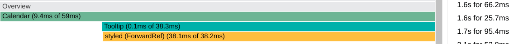
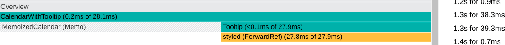
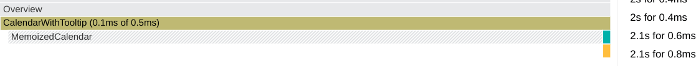

需要实现 GitHub 日历里的 tooltip，常规的 Tooltip 组件是包裹在其他组件上，比如 Primer 提供的 [Tooltip](https://primer.style/react/Tooltip)：

```jsx
<Tooltip aria-label="Hello, Tooltip!" direction="nw">
  <Button>Default</Button>
</Tooltip>
```

和 Ant Design 的 [Tooltip 文字提示](https://ant.design/components/tooltip-cn/#API)：

```jsx
<Tooltip title="prompt text">
  <span>Tooltip will show on mouse enter.</span>
</Tooltip>
```

而日历的日期太多，不可能给每天（`Rect` 方块）都套上一个 `Tooltip`，所以不能使用现成的 Primer 组件

发现其他两个日历实现——[kevinsqi/react-calendar-heatmap](https://github.com/kevinsqi/react-calendar-heatmap) 和 [grubersjoe/react-github-calendar](https://github.com/grubersjoe/react-github-calendar) 依赖的 [react-tooltip](https://github.com/wwayne/react-tooltip/blob/master/src/index.js) 使用了“全局”的 Tooltip，正适合这个场景。

因为要学习 React API，所以自己写了一个：

## GitHub 的 Tooltip 实现

GitHub 的日历 Tooltip 目前是 vanilla js 实现的。在日历总的 `svg` 标签上监听了 [`mouseover`](https://developer.mozilla.org/en-US/docs/Web/API/Element/mouseover_event) 和 [`mouseout`](https://developer.mozilla.org/en-US/docs/Web/API/Element/mouseout_event) 事件，然后通过 `e.target` 获得 `rect` 的位置数据显示 tooltip

<details><summary>打开开发者工具可以找到相关代码</summary>

```ts
observe('.js-calendar-graph-svg', function (el) {
  const container = el.closest<HTMLElement>('.js-calendar-graph')!
  container.addEventListener('mouseover', function (event: Event) {
    const target = event.target as Element
    if (target.matches('rect[data-count]')) {
      showTooltip(target)
    }
  })
  container.addEventListener('mouseout', hideTooltip)
  const fromStr = container.getAttribute('data-from')
  if (fromStr) {
    previousDay = utcDate(fromStr)
  }
})

function hideTooltip() {
  if (currentTooltip) {
    currentTooltip.hidden = true
  }
}

function showTooltip(el: Element) {
  hideTooltip()

  const date = utcDate(el.getAttribute('data-date')!)
  const count = parseInt(el.getAttribute('data-count') || '')

  const formatted = new Intl.DateTimeFormat('en-US', {
    month: 'short',
    day: 'numeric',
    year: 'numeric',
    timeZone: 'UTC'
  }).format(date)
  const label = count === 0 ? 'No' : new Intl.NumberFormat('en-US').format(count)

  const strong = document.createElement('strong')
  strong.textContent = `${label} ${count === 1 ? 'contribution' : 'contributions'}`

  currentTooltip.innerHTML = ''
  currentTooltip.append(strong, ` on ${formatted}`)

  // We have to show the tooltip before calculating it's position.
  currentTooltip.hidden = false

  const bounds = el.getBoundingClientRect()
  const x = bounds.left + window.pageXOffset - currentTooltip.offsetWidth / 2 + bounds.width / 2
  const y = bounds.bottom + window.pageYOffset - currentTooltip.offsetHeight - bounds.height * 2
  const graphContainer = document.querySelector('.js-calendar-graph')
  const graphContainerBounds = graphContainer!.getBoundingClientRect()
  currentTooltip.style.top = `${y}px`

  if (isTooFarLeft(graphContainerBounds, x)) {
    currentTooltip.style.left = `${southwestTooltip(bounds)}px`
    currentTooltip.classList.add('left')
    currentTooltip.classList.remove('right')
  } else if (isTooFarRight(graphContainerBounds, x)) {
    currentTooltip.style.left = `${southeastTooltip(bounds)}px`
    currentTooltip.classList.add('right')
    currentTooltip.classList.remove('left')
  } else {
    currentTooltip.style.left = `${x}px`
    currentTooltip.classList.remove('left')
    currentTooltip.classList.remove('right')
  }
}

function isTooFarLeft(graphContainerBounds: DOMRect, tooltipX: number) {
  return graphContainerBounds.x > tooltipX
}

function isTooFarRight(graphContainerBounds: DOMRect, tooltipX: number) {
  return graphContainerBounds.x + graphContainerBounds.width < tooltipX + currentTooltip.offsetWidth
}

function southwestTooltip(bounds: DOMRect) {
  return bounds.left + window.pageXOffset - currentTooltip.offsetWidth * 0.1 + bounds.width / 2
}

function southeastTooltip(bounds: DOMRect) {
  return bounds.left + window.pageXOffset - currentTooltip.offsetWidth * 0.9 + bounds.width / 2
```

</details>

## 我的 naive 实现

React 使用合成事件，而且会自动委托，所以可以直接把 listener 加到每个 `<rect>` 上（还有个类似 `mouseover` 的事件： [`mouseenter`](https://developer.mozilla.org/en-US/docs/Web/API/Element/mouseenter_event) 事件，本身不支持冒泡，但 React 让它也能被委托（通过 `mouseover` 事件实现））

<details><summary>我简单地在 `<rect>` `onMouseEnter` 时修改 Tooltip 的位置和内容，简化的代码：</summary>

```js
import React, { useState } from 'react';

export default function App() {
  return (
    <div>
      <Calendar />
    </div>
  );
}

function Tooltip({ left, top, children }) {
  return (
    <div style={{ transform: 'translateY(-50%)', position: 'absolute', left, top }}>
      {'<'}
      {children}
    </div>
  );
}

function Calendar() {
  const [tooltip, setTooltip] = useState(null);

  function handleMouseEnter(e) {
    const bonds = e.target.getBoundingClientRect();
    setTooltip({
      left: bonds.right,
      top: bonds.top,
      text: e.target.dataset.tip,
    });
  }

  return (
    <div style={{ position: 'relative' }}>
      <span data-tip="tip1" onMouseEnter={handleMouseEnter}>
        1
      </span>
      <br />
      <span data-tip="tip2" onMouseEnter={handleMouseEnter}>
        2
      </span>
      {tooltip && (
        <Tooltip left={tooltip.left} top={tooltip.top}>
          {tooltip.text}
        </Tooltip>
      )}
    </div>
  );
}
```

</details>

鼠标在日期间快速滑动，渲染速度和原生的有明显差距，build 后的版本貌似好一点但还是很明显

参考：

- [Handling Events](https://reactjs.org/docs/handling-events.html)
- [Responding to Events](https://beta-reactjs-org-mtdw7s9u4-fbopensource.vercel.app/learn/responding-to-events)
- [What is the difference between the mouseover and mouseenter events?](https://stackoverflow.com/a/1104381/5783347)

## 使用 React Profiler

看到官方的新文档里说：

> Don’t optimize prematurely!

虽然在其他地方做了很多无用功，但这个 tooltip 确实需要优化

使用 React Profiler 可以看到：



猜想：

- Tooltip 使用了 styled-components，可能比较影响性能
  - 从浏览器 Elements Inspector 里也能看到 `<style>` 被不断更新
  - Chrome 自带的 Performance 里图我看不太懂，但也能看出 styled-components 确实占用了时间
- Calendar 被 `setState` 不断触发 rendering，即使 SVG 日历在 tooltip 划过时内容应该是不变的

所以我可能需要：

- 分离日历主体部分并使用 `useMemo` 来跳过 diff 检查（实际上：应该使用 `React.memo`）
- 优化 Tooltip 样式。目前感觉是因为我使用 `sx`（Primer 封装的 Styled System API）来修改 Tooltip 的样式（实际上：改为 `style` 就好了）

其他实现：

- 观察了下 [react-tooltip](https://github.com/wwayne/react-tooltip/blob/9006d11aa2/src/index.js) 的实现：手动监听事件但是通过 React 来渲染 tooltip。因为只渲染 tooltip 所以没有性能问题，手动监听大概是为了方便
- React Profiler 自己也[实现了一个 tooltip](https://github.com/facebook/react/blob/main/packages/react-devtools-shared/src/devtools/views/Profiler/Tooltip.js)，不过好像性能也不太行

参考：

- [Optimizing Performance](https://reactjs.org/docs/optimizing-performance.html)
- [Introducing the React Profiler](https://reactjs.org/blog/2018/09/10/introducing-the-react-profiler.html)
- [Analyze runtime performance](https://developer.chrome.com/docs/devtools/evaluate-performance/)

## `React.memo`、`useMemo`、`useCallback`

> This process(_rendering_) is recursive: if the updated component returns some other component, React will render that component next, and if that component also returns something, it will render that component next, and so on. The process will continue until there are no more nested components and React knows exactly what should be displayed on screen. --from [_Step 2: React renders your components_](https://beta.reactjs.org/learn/render-and-commit#:~:text=This%20process%20is%20recursive%3A%20if%20the%20updated%20component%20returns%20some%20other%20component%2C%20React%20will%20render%20that%20component%20next%2C%20and%20if%20that%20component%20also%20returns%20something%2C%20it%20will%20render%20that%20component%20next%2C%20and%20so%20on.)

所以父组件状态更新子组件也会 rerender，即使子组件的状态没变。对类组件可以使用 [`React.PureComponent`](https://reactjs.org/docs/react-api.html#reactpurecomponent) 和 [`shouldComponentUpdate`](https://reactjs.org/docs/react-component.html#shouldcomponentupdate) 来跳过（修改）子组件的 rendering 过程；对函数组件可以使用 [`React.memo`](https://reactjs.org/docs/react-api.html#reactmemo)、[`useMemo`、`useCallback`](https://reactjs.org/docs/hooks-reference.html#usecallback)

所以我：

- 把日历抽离出来作为一个组件，并使用 `React.memo` 让它只在 props 变化时在 rerender
- 使用 `useCallback` 缓存传入日历组件的 handlers

这样 tooltip 移动时日历组件便不再 rerender



---

`React.memo`

> React.memo only checks for prop changes. If your function component wrapped in React.memo has a useState, useReducer or useContext Hook in its implementation, it will still rerender when state or context change.

所以大概：

- context 全局更改触发 rerender
- prop 父组件更改触发 rerender。`React.memo` 可以决定是否进行 rerender
- state 自身更改触发 rerender

参考：

- [Render and Commit](https://beta.reactjs.org/learn/render-and-commit)
- [Reconciliation](https://reactjs.org/docs/reconciliation.html)
- [Use React.memo() wisely](https://dmitripavlutin.com/use-react-memo-wisely/)
- [How to Memoize with React.useMemo()](https://dmitripavlutin.com/react-usememo-hook/)
- [React Top-Level API](https://reactjs.org/docs/react-api.html#reactmemo)

## styled-components 的问题

至于 styled-components 的问题，因为其实不需要 `sx`，所以 我把`sx` 换成 `style` 就解决了，这样 `<style>` 便不再在 tooltip 移动时更新了

```diff
(<Tooltip
  direction="center"
  hidden={!!tooltip}
- sx={
+ style={
    tooltip
      ? { display: 'inline-block', left: tooltip.x, top: tooltip.y }
      : {}
  }
>)
```



此外在移动时更新样式而不是销毁后重新生成（效仿了 GitHub tooltip）

## `useRef`、`forwardRef`、`useLayoutEffect`、`flushSync`

解决了性能问题，现在解决下 tooltip 在边缘时可能被遮挡的问题。因为要判断默认样式的 tooltip 的边缘是否超过日历的边缘，所以需要使用 ref 来获得两者的位置信息

获得 tooltip 自己实际的尺寸后决定是否修改样式（🔽 在左边、中间还是右边），如何修改 `className` 呢？

- [ ] 使用 `useLayoutEffect` + `ref`（如果使用 `useEffect` 确实会观察到抖动）
- [ ] 使用 `useLayoutEffect` + `flushSync`。“语义”上是对的而且看起来工作正常，但是报 warning：flushSync was called from inside a lifecycle method. 貌似不应该这样使用 `flushSync`
- [x] 在事件 handler 中使用 `flushSync` setState；读取 ref 并判断，如果超过边缘则再使用一个 `flushSync` setState 进而修改样式

---

使用 `forwardRef` 绑定 `ref` 到组件的真实的元素上

参考：

- [Have you used `flushSync` in React?](https://dev.to/somshekhar/have-you-used-flushsync-in-react-4cpo)

## 总结

- 比想象的顺利：本以为要使用 `useRef` 使用原生的 JS，结果 React 本身的效率就足够了
- 最终选择了正确的 API：使用 `React.memo` 而不是 `useMemo`
- 所以，如果使用其他框架是不需要做这些“优化”的？
