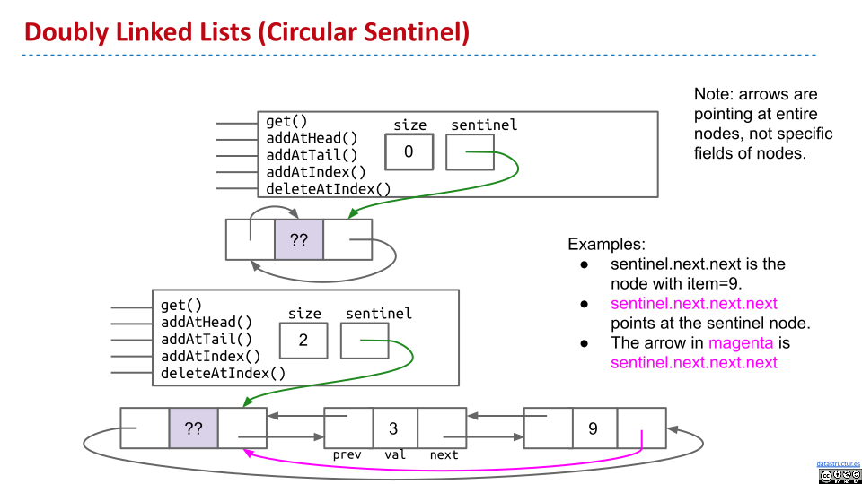

# Doubly Linked List with Sentinel in TypeScript

今天的 study plan 又遇到了 [707. Design Linked List](https://leetcode.com/problems/design-linked-list)，改进了一下之前写的。觉得不错，所以用 LeetCode 的新 UI [发了自己的解](https://leetcode.com/problems/design-linked-list/solutions/2910657/typescript-doubly-linked-list-with-sentinel/)

refs:

- [the usage of "if...otherwise](https://forum.wordreference.com/threads/the-usage-of-if-otherwise.2075849/)

## Intuition

Refer to [the slides from CS61B](https://docs.google.com/presentation/d/19_KxuUVlMlJPKAhBfGPlU1KLtra_o-cVJGaQ1Nw7V7M/edit#slide=id.g829fe3f43_0_376). (CC BY-NC-SA)



## Approach

- A sentinel node shown in the figure above is used to avoid edge cases
- A helper method(`getNode`) is shared by other methods
  - `getNode(index)` returns the node at `index`
  - `getNode(index - 1)` returns the parent node of the node at `index`
  - `getNode(-1)` returns `sentinel`
- We traverse forward if the given `index <= size / 2`, and backward otherwise

There is [a similar solution in Python](https://leetcode.com/problems/design-linked-list/solutions/210129/cs61b-berkeley-doubly-linked-list-with-circular-sentinel/)

## Complexity

- Time complexity:
  - `get` `addAtIndex` `deleteAtIndex` $O(n)$
  - `addAtHead` `addAtTail` $O(1)$
- Space complexity:
  - $O(1)$ extra space

## Code

```ts
class DLNode {
  public val: number;
  public prev: DLNode;
  public next: DLNode;

  constructor(val: number, prev?: DLNode, next?: DLNode) {
    this.val = val;
    this.prev = prev ?? this;
    this.next = next ?? this;
  }
}

class MyLinkedList {
  private sentinel: DLNode;
  private size: number;

  constructor() {
    this.sentinel = new DLNode(42);
    this.size = 0;
  }

  private getNode(index: number): DLNode {
    // If index equals -1, sentinel will be returned
    let forward = index <= this.size / 2;
    let n = index <= this.size / 2 ? index + 1 : this.size - index;
    let p = this.sentinel;

    while (n > 0) {
      p = forward ? p.next : p.prev;
      n -= 1;
    }

    return p;
  }

  get(index: number): number {
    if (index < 0 || index > this.size - 1) {
      return -1;
    }

    return this.getNode(index).val;
  }

  addAtHead(val: number): void {
    this.addAtIndex(0, val);
  }

  addAtTail(val: number): void {
    this.addAtIndex(this.size, val);
  }

  addAtIndex(index: number, val: number): void {
    if (index < 0 || index > this.size) {
      return;
    }

    const parent = this.getNode(index - 1);
    const oldNext = parent.next;
    parent.next = new DLNode(val, parent, oldNext);
    oldNext.prev = parent.next;
    this.size += 1;
  }

  deleteAtIndex(index: number): void {
    if (index < 0 || index > this.size - 1) {
      return;
    }

    const parent = this.getNode(index - 1);
    const next = parent.next.next;
    parent.next = next;
    next.prev = parent;
    this.size -= 1;
  }
}
```
